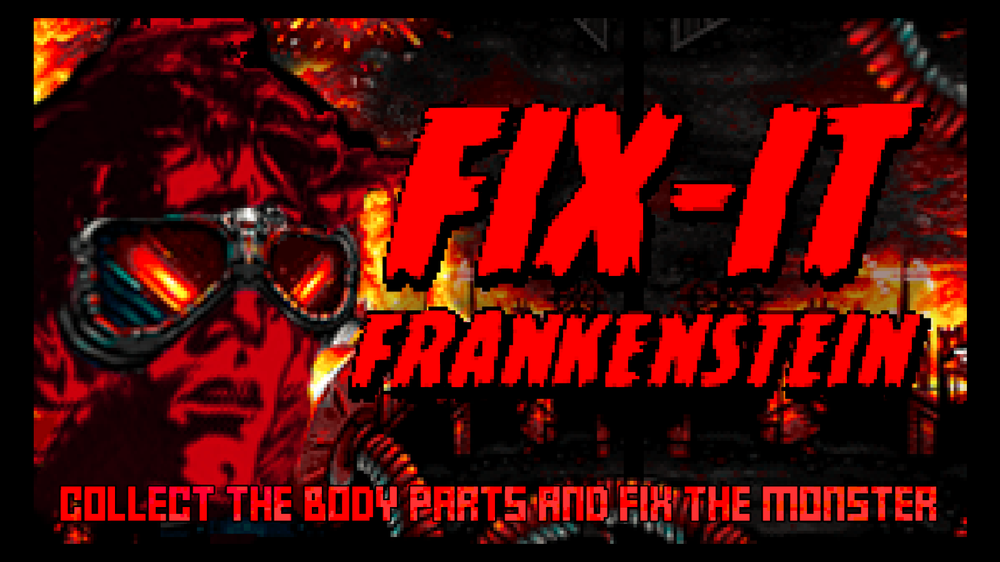

# Fix-It Frankenstein - GGJ20

## Controls

### Controller

* **Movement:** `LeftStick`
* **Grab/Drop:** `A`
* **Event:** `A` `B` `X` `Y`

### Keyboard

* **Movement:** `W` `S` `A` `D` | `ArrowKeys`
* **Grab/Drop:** `E` | `Space`
* **Event:** `1` `2` `3` `4` | `V` `B` `N` `M` (green, red, blue, yellow)

## Description

### EN - english

You are the honored Doctor Frankenstein, and the villagers want (once again), your head. Together with your faithful assistant Gregor, your task is to repair the monsters that are destroying You will need to work together to repair the monsters as you have access to different body parts. Will you be able to push back the pack of fork-wielding villagers, or will you destroy your creatures faster than you can put them together and finally overrun your fortress last?

The controls are quite simple. You move with the control stick and pick up body parts from the assembly line with A. You can either place them on the table in the middle to give them to your helper, or bring them to the table with the body parts to assemble the monster. Once you have all the parts together you will need to press a sequence of four keys to complete the process and release your handcuff on the villagers.

### DE - german

Ihr seid der geehrte Doktor Frankenstein, und die Dorfbewohner wollen (mal wieder), euren Kopf. Zusammen mit eurem treuen Gehilfen Gregor ist es eure Aufgabe so schnell wie möglich die Monster zu reparieren, welche die Dorfbewohner zerstören, damit ihr Sie erneut in den Kampf schicken könnt, um euer Schloss zu retten. Ihr müsst zusammenarbeiten, um die Monster zu reparieren, da ihr auf unterschiedliche Körperteile Zugriff habt. Werdet ihr es schaffen die Meute mistgabelschwingender Dorftrottel zurück zu drängen, oder werden Sie eure Kreaturen schneller zerstören, als ihr Sie zusammensetzen könnt, und eure Festung letzten endlich überrennen?

Die Steuerung ist recht einfach. Ihr bewegt euch mit dem Steuerungsstick und nehmt Körperteile vom Fließband mit A auf. Ihr könnt Sie entweder auf den Tisch in der Mitte legen um Sie eurem Gehilfen zu geben, oder Sie zum Tisch mit den Körperteilen bringen um das Monster zusammen zu setzen. Habt ihr alle Teile zusammen müsst ihr eine Folge von vier Tasten drücken um den Prozess zu vollenden und euren Handlager auf die Dorfbewohner loszulassen.

## Diversifiers

### A kind of cooperation

> Create a co-operative multiplayer game that encourages collaboration and kindness.  
> — sponsored by: [Sony Interactive Entertainment](https://www.sie.com/en/)

### Language-Independence

> Create a game that can be understood regardless of which language the player speaks.  
> — sponsored by: [Valve Software](https://www.valvesoftware.com/)

### De-squintify

> Text size can be changed by players, or is at least 28px height by default.
